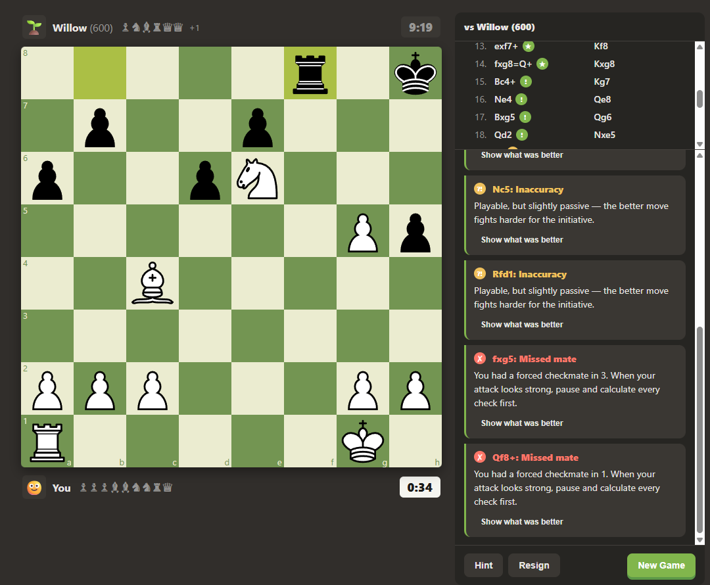

# Chess Plus


*Playing a 600-Elo bot - the coach flags inaccuracies and missed mates move by move.*

A chess.com-style app for playing **human-like bots** — with a built-in teacher.

Unlike bots that play perfectly and then randomly blunder, Chess Plus bots pick
moves the way people do: they follow plans, make many small mistakes and few
catastrophic ones, err more in sharp positions than quiet ones, and carry
rating-appropriate blind spots (a 600 loves checks and captures; a 2200 does
not). See `PROJECT_PLAN.md` §3 for how the humanizer works.

## Features

- **Play bots from 600 to 2200 Elo** — Stockfish MultiPV candidates run through
  a humanizing layer (plan bias → Elo-scaled softmax → blunder-awareness check).
- **Coach** — classifies every move you make (Best → Blunder, chess.com-style
  badges) and explains the *why*: hanging pieces, king-shield damage, doubled
  pawns, missed mates, opening principles.
- **Guide, not a cheat engine** — feedback is retrospective; hints escalate
  concept → piece → move only when you ask, and move-level hints are recorded
  in your game summary. No eval bar during play.
- **Opening teacher** — recognizes classic systems (London, Italian, Ruy Lopez,
  QGD, Caro-Kann, Sicilian), narrates the ideas behind book moves, and shows
  what theory recommended when the game leaves book.
- **Endgame guide** — technique lessons (box method, ladder mate) with live
  phase narration, stalemate warnings, and a 50-move-rule countdown.
- **Checkmate puzzles** — solver-verified mate-in-1/2 trainer; *any* move that
  keeps the forced mate counts, and the defender plays its most resilient reply.

## Development

```bash
npm install        # also copies the Stockfish WASM build into public/engine
npm run dev        # dev server
npm test           # vitest — core logic + solver-verified puzzle data
npm run build      # type-check + production build
npm run preview    # serve the production build
```

The engine (Stockfish 17.1 lite, single-threaded WASM) runs entirely in Web
Workers in the browser — there is no backend.

## Project layout

```
src/core/bot/       humanizer, plans, personas   (pure TS, unit-tested)
src/core/coach/     move classification + explanations
src/core/openings/  opening book + recognizer
src/core/endgame/   basic-mate technique guide
src/core/puzzles/   mate solver + puzzle data
src/engine/         UCI client for the Stockfish worker
src/components/     board, panels, move list
src/pages/          Play (vs bot) and Puzzles
tools/              engine asset copier
```

See `PROJECT_PLAN.md` for the full roadmap.
